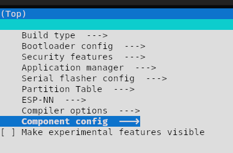
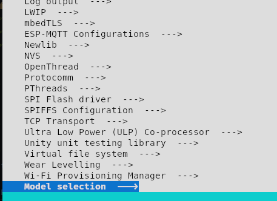

# ESP-Metric

- Bare minimum Tensorflow lite micro implementation
- Models and input data is located in the `components` folder.
- Because of no IO or sensor dependencies this project is easy to build for other ESP32 chips e.g the `ESP32-s3`

> Example
```sh
    idf.py set-target esp32
```

## How to build this project:

1. Enable your IDF environment

2. Remember to run `main.py` in the `Python`
   > This is needed to generate the new versin of the model.

3. Config the project
    ```sh
        idf.py menuconfig
    ```
    You will enter a terminal gui:

    
    > Select the component config

    

    > Find the component `Model selection` (Most like the last option)

4. Set which model you want to run.

5. Build, flash and monitor using `idf.py`


### Adding more stuff into Menuconfig
- If you want to add more into `menuconfig` take a look at `components/models/Kconfig`
- And more can be here: https://docs.espressif.com/projects/esp-idf/en/latest/esp32/api-reference/kconfig.html